# Module 6: Lecture Code Walkthrough

> **How to read this file**
> - Every code block is the **lecture code**, cleaned up only for formatting (HTML symbols like `&lt;` turned back into `<`). The logic is unchanged.
> - Each program has the same sections: **What it is**, **What it's doing**, **Why it's helpful**, and **Key takeaways**.
> - ⭐ **KEY** = important idea, 🧠 = memory aid, ⚠️ = bug or gotcha.
> - 📎 **SUPPLEMENTAL** = anything I added that wasn't in the lecture: extra code, fixes, compile commands, sample output.

---

## Table of Contents

| # | Program | Main Concept |
|---|---|---|
| 1 | [Multithreaded isPrime](#1-multithreaded-isprime) | `pthread_create` / `pthread_join` basics, task parallelism |
| 2 | [Hello World with N Threads](#2-hello-world-with-n-threads) | Creating a variable number of threads, passing IDs |
| 3 | [pthread_join Explained + Scalar Multiply (globals)](#3-pthread_join-explained--scalar-multiply-globals-version) | Non-deterministic order, joining, **data parallelism** with chunks |
| 4 | [Scalar Multiply: main with a Struct of Arguments](#4-scalar-multiply-main-with-a-struct-of-arguments) | Passing many arguments with a struct |
| 5 | [Scalar Multiply: Thread Function Using the Struct](#5-scalar-multiply-thread-function-using-the-struct) | Unpacking struct args, chunking |
| 6 | [Shared Sum Data Race](#6-shared-sum-data-race) | ⚠️ **Data race**, lost updates |
| 7 | [Counting Sort (Sequential)](#7-counting-sort-sequential) | Baseline single-threaded algorithm |
| 8 | [Parallel countElems (First Cut)](#8-parallel-countelems-first-cut) | Data parallelism, ⚠️ **hidden data race on `counts`** |
| 9 | [Parallel Counting Sort main](#9-parallel-counting-sort-main) | Wiring it all together with threads |
| — | [Patterns Across All Programs](#patterns-across-all-programs) | The repeated "recipe" |
| — | [📎 Supplemental Fixes for Program 8](#-supplemental-fixes-for-program-8) | Mutex and local-counts versions |

📎 **SUPPLEMENTAL: How to compile any of these**

```bash
gcc -Wall -pthread program.c -o program
./program            # programs 1 and 6
./program 4          # program 2 (4 threads)
```

---

## The Big Picture: How the Programs Build on Each Other

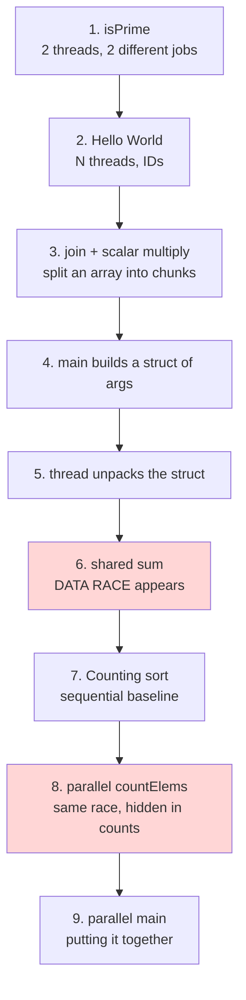

---

## 1. Multithreaded isPrime

### What it is
The lecture's first threaded program. It takes the slow single-threaded isPrime program and runs the **two isPrime calls on two separate threads**.

### The code

```c
#include <stdio.h>
#include <pthread.h>

int isPrime(int n) {
    if (n < 2) {
        return 0;
    }

    for (int i = 2; i < n; i++) {
        if (n % i == 0) {
            return 0;
        }
    }

    return 1;
}

void *primeThread(void *arg) {
    int n = *(int *)arg;
    int result = isPrime(n);

    printf("%d is %s\n",
           n,
           result ? "prime" : "not prime");

    return NULL;
}

int main() {
    pthread_t t1, t2;

    int n1 = 479001599;
    int n2 = 349001597;

    pthread_create(&t1, NULL, primeThread, &n1);
    pthread_create(&t2, NULL, primeThread, &n2);

    pthread_join(t1, NULL);
    pthread_join(t2, NULL);

    return 0;
}
```

### What it's doing, line by line

| Part | What it does |
|---|---|
| `isPrime(int n)` | Brute-force prime check. Tries every divisor from 2 to n−1. Very **CPU-bound** (hundreds of millions of loop iterations). |
| `void *primeThread(void *arg)` | The **thread function** (wrapper). pthreads requires the signature `void *f(void *)`. |
| `int n = *(int *)arg;` | ⭐ Casts the generic `void *` back to `int *`, then **dereferences** it to get the number. |
| `result ? "prime" : "not prime"` | Ternary operator: picks the string to print. |
| `return NULL;` | The thread has nothing to return. |
| `pthread_t t1, t2;` | Two thread handles (IDs). |
| `pthread_create(&t1, NULL, primeThread, &n1);` | Start a new thread: store its ID in `t1`, default attributes, run `primeThread`, pass it the **address of `n1`**. |
| `pthread_join(t1, NULL);` | `main` **waits** for t1 to finish. `NULL` means "I don't need its return value." |

### Execution picture

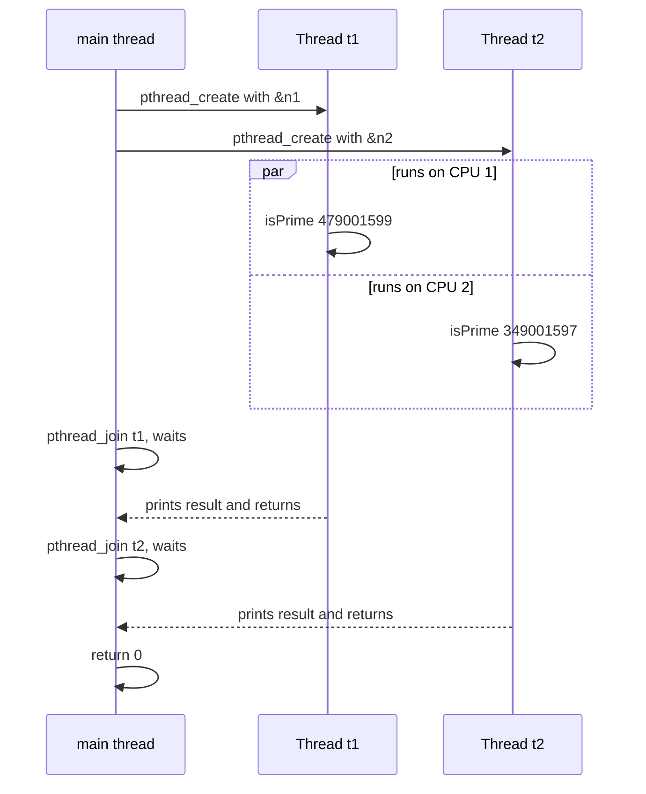

### Why it's helpful
- Shows the **minimal pthread recipe**: write a thread function, create threads, join threads.
- Turns a program that could only use **1 core** into one that can use **2 cores**, for roughly a **2× speedup** on a multi-core machine.
- This is **task parallelism** (two independent jobs running at the same time). 📎 Some instructors call it data parallelism because it's the same function on different inputs.

### ⭐ Key takeaways
- `pthread_create` is **4 args**: `(&id, attributes, function, &argument)`.
- The argument is passed as a **pointer** (`&n1`), so the thread **casts it back** and dereferences it.
- **Without the joins**, `main` could `return 0` first, which ends the whole process before anything prints.
- 📎 The two output lines can appear in **either order**, depending on which thread finishes first.

> 🧠 **"Wrap, Create, Join"**: wrap the work in a `void*` function, create the threads, join them.

---

## 2. Hello World with N Threads

### What it is
A generalized version of Program 1: the **user chooses how many threads** to create from the command line, and each thread prints its own ID.

### The code

```c
#include <stdio.h>
#include <stdlib.h>
#include <pthread.h>

/* The "thread function" passed to pthread_create.  Each thread executes this
 * function and terminates when it returns from this function. */
void *HelloWorld(void *id) {

    /* We know the argument is a pointer to a long, so we cast it from a
     * generic (void *) to a (long *). */
    long *myid = (long *) id;

    printf("Hello world! I am thread %ld\n", *myid);

    return NULL; // We don't need our threads to return anything.
}

int main(int argc, char **argv) {
    int i;
    int nthreads; //number of threads
    pthread_t *thread_array; //pointer to future thread array
    long *thread_ids;

    // Read the number of threads to create from the command line.
    if (argc !=2) {
        fprintf(stderr, "usage: %s <n>\n", argv[0]);
        fprintf(stderr, "where <n> is the number of threads\n");
        return 1;
    }
    nthreads = strtol(argv[1], NULL, 10);

    // Allocate space for thread structs and identifiers.
    thread_array = malloc(nthreads * sizeof(pthread_t));
    thread_ids = malloc(nthreads * sizeof(long));

    // Assign each thread an ID and create all the threads.
    for (i = 0; i < nthreads; i++) {
        thread_ids[i] = i;
        pthread_create(&thread_array[i], NULL, HelloWorld, &thread_ids[i]);
    }

    /* Join all the threads. Main will pause in this loop until all threads
     * have returned from the thread function. */
    for (i = 0; i < nthreads; i++) {
        pthread_join(thread_array[i], NULL);
    }

    free(thread_array);
    free(thread_ids);

    return 0;
}
```

### What it's doing

| Step | Code | Purpose |
|---|---|---|
| 1 | `if (argc != 2)` | Make sure the user gave exactly one argument (the thread count). |
| 2 | `strtol(argv[1], NULL, 10)` | Convert the string `"4"` to the number `4` (base 10). |
| 3 | `malloc(nthreads * sizeof(pthread_t))` | ⭐ **Dynamically** allocate one `pthread_t` per thread, since we don't know N at compile time. |
| 4 | `malloc(nthreads * sizeof(long))` | One ID slot per thread. |
| 5 | **Create loop** | Give each thread its own ID, then start it with a pointer to **its own** slot `&thread_ids[i]`. |
| 6 | **Join loop** | `main` waits for **every** thread. |
| 7 | `free(...)` | Clean up heap memory. This is only safe **after** all joins. |

### Memory picture

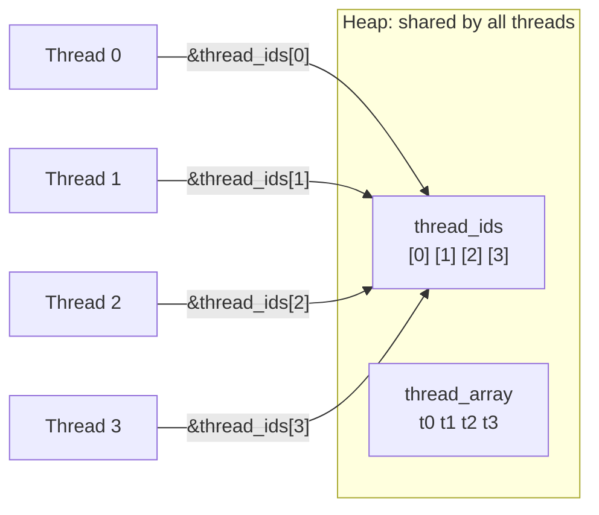

### 📎 SUPPLEMENTAL: Sample output (`./hello 4`)

```
Hello world! I am thread 2
Hello world! I am thread 0
Hello world! I am thread 3
Hello world! I am thread 1
```
Run it again and the order will likely **change**. That's non-deterministic scheduling (see Program 3).

### Why it's helpful
- Scales from **2 hard-coded threads** to **any number of threads**, which you need to match the number of cores.
- Introduces the standard **thread array + ID array** pattern that Programs 3–9 all reuse.
- Shows how to give each thread a **unique identity**, which is how each thread later knows **which chunk of work is its own**.

### ⭐ Key takeaways
- **Two loops:** a create loop, then a separate join loop. Joining inside the create loop would make the threads run **one at a time**. 📎
- ⚠️ 📎 **Why not just pass `&i`?** All threads would get a pointer to the **same** `i`, which `main` keeps changing. Threads could read the wrong ID (a race). That's why each thread gets its **own** slot `thread_ids[i]`.
- `free` only **after** joining. Freeing earlier could pull memory out from under running threads.

> 🧠 **"Allocate, Assign, Create, Join, Free"** is the N-thread recipe.

---

## 3. `pthread_join` Explained + Scalar Multiply (globals version)

### What it is
Two parts:
1. **Lecture notes** on `pthread_join` and scheduling order (plus the HelloWorld function again).
2. The first **real data-parallel program**: multiply every element of a huge array by a scalar `s`, with each thread handling **its own chunk**.

### 3a. Key lecture points on `pthread_join`

> ⭐ **The OS schedules each thread. You cannot assume anything about the order threads run in.**

```c
pthread_join(pthread_t thread, void **return_val)
```

| Argument | Meaning |
|---|---|
| `thread` | **Which** thread to wait for (passed by value, not a pointer). |
| `return_val` | **Where** to store the thread's return value. `NULL` means "I don't care." |

- `pthread_join` **suspends the caller** until that thread **terminates**.
- `pthread_join(thread_array[t], NULL);` means "main waits for thread t and ignores its return value."
- `main` joins **in a loop** because **all** workers must finish before `main` cleans up memory and ends the process:

```c
for (i = 0; i < nthreads; i++) {
    pthread_join(thread_array[i], NULL);
}
```

The thread function again:

```c
void *HelloWorld(void *id) {
    long *myid = (long*)id;

    printf("Hello world! I am thread %ld\n", *myid);

    return NULL;
}
```

### 3b. Scalar multiply (globals version)

```c
long *array; //allocated in main
long length; //set in main (1 billion)
long nthreads; //number of threads
long s; //scalar

void *scalar_multiply(void *id) {
    long *myid = (long *) id;
    int i;

    //assign each thread its own chunk of elements to process
    long chunk = length / nthreads;
    long start = *myid * chunk;
    long end  = start + chunk;
    if (*myid == nthreads - 1) {
        end = length;
    }

    //perform scalar multiplication on assigned chunk
    for (i = start; i < end; i++) {
        array[i] *= s;
    }

    return NULL;
}
```

### What it's doing

| Line | Purpose |
|---|---|
| Globals `array, length, nthreads, s` | ⭐ **Shared by all threads** because globals live in the shared address space. That's how every thread "sees" the array without being passed it. |
| `chunk = length / nthreads` | How many elements each thread gets (integer division). |
| `start = *myid * chunk` | Where this thread's chunk begins. |
| `end = start + chunk` | Where it ends (exclusive). |
| `if (*myid == nthreads - 1) end = length;` | ⭐ The **last thread picks up the leftovers** when `length` isn't evenly divisible. |
| `array[i] *= s` | The actual work. Each thread **only touches its own indices**. |

### ⭐ How the chunking works

Example: `length = 10`, `nthreads = 3`, so `chunk = 10/3 = 3`

| Thread id | start | end | Indices handled |
|---|---|---|---|
| 0 | 0 | 3 | 0, 1, 2 |
| 1 | 3 | 6 | 3, 4, 5 |
| 2 (last) | 6 | **10** (not 9) | 6, 7, 8, **9** ← leftover |

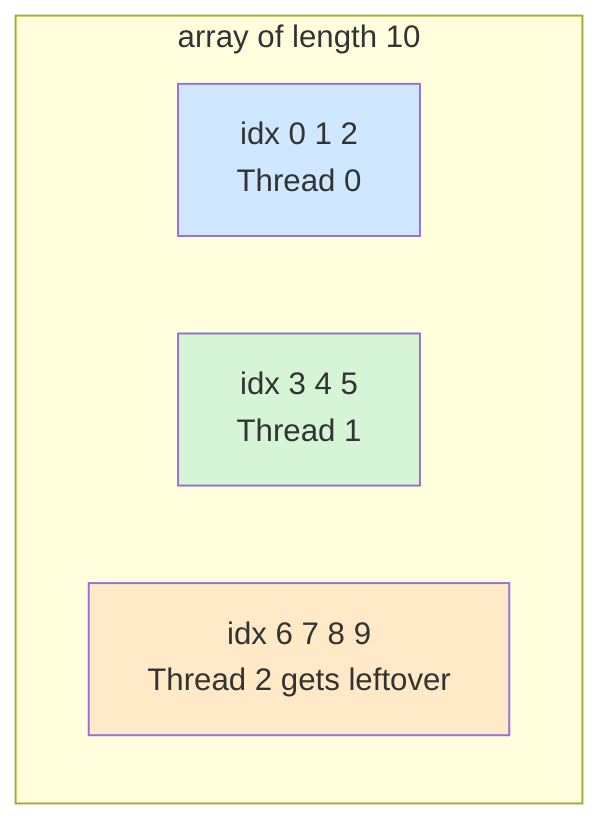

### Why it's helpful
- ⭐ This is the textbook example of **data parallelism**: the **same operation** (`*= s`) on **different chunks** of the data.
- With 1 billion elements, splitting the work across N cores gives close to **linear speedup**.
- **No data race:** threads write to the shared `array`, but to **non-overlapping indices**, so no two threads ever touch the same element. Shared data is fine when the **parts don't overlap**.

### ⭐ Key takeaways
- The **thread ID** decides **which slice** a thread works on.
- **Last thread takes the remainder** so no element gets skipped.
- Shared globals are **convenient**, but they make the function depend on global state. Programs 4 and 5 fix that with a struct.
- ⚠️ 📎 `int i` is compared against `long start/end`. With `length` = 1 billion it still fits in an `int` (max ≈ 2.1 billion), but `long i` would be safer for larger arrays.

> 🧠 **"ID × chunk = start; last one sweeps up."**

---

## 4. Scalar Multiply: main with a Struct of Arguments

### What it is
Part of `main` for a **better** scalar-multiply version. Instead of globals, it packs everything each thread needs into a **struct** (`struct t_arg`) and gives each thread its own.

### The code

```c
long nthreads = strtol(argv[1], NULL, 10); //get number of threads
long length = strtol(argv[2], NULL, 10); //get length of array
long s = strtol( argv[3], NULL, 10 ); //get scaling factor

int *array = malloc(length*sizeof(int));

//allocate space for thread structs and identifiers
pthread_t *thread_array = malloc(nthreads * sizeof(pthread_t));
struct t_arg *thread_args = malloc(nthreads * sizeof(struct t_arg));

//Populate thread arguments for all the threads
for (i = 0; i < nthreads; i++){
    thread_args[i].array = array;
    thread_args[i].length = length;
    thread_args[i].s = s;
    thread_args[i].numthreads = nthreads;
    thread_args[i].id = i;
}
```

### 📎 SUPPLEMENTAL: The struct definition (not shown in the lecture snippet)
Based on the fields used, it would look like this:

```c
struct t_arg {
    int  *array;      // pointer to the SHARED array in main
    long  length;     // total length of the array
    long  s;          // scaling factor
    long  numthreads; // total number of threads
    long  id;         // THIS thread's id (unique per thread)
};
```

### What it's doing

| Step | Purpose |
|---|---|
| Read 3 command-line args | Thread count, array length, scalar. |
| `malloc` the array | The big shared data. |
| `malloc` `thread_array` | One `pthread_t` per thread. |
| `malloc` `thread_args` | ⭐ **One struct per thread**, so each thread gets its own argument bundle. |
| Fill loop | Every struct gets the **same** array pointer, length, s, and numthreads, but a **different `id`**. |

📎 The `pthread_create` call isn't shown in this snippet. It would be:
```c
pthread_create(&thread_array[i], NULL, scalar_multiply, &thread_args[i]);
```

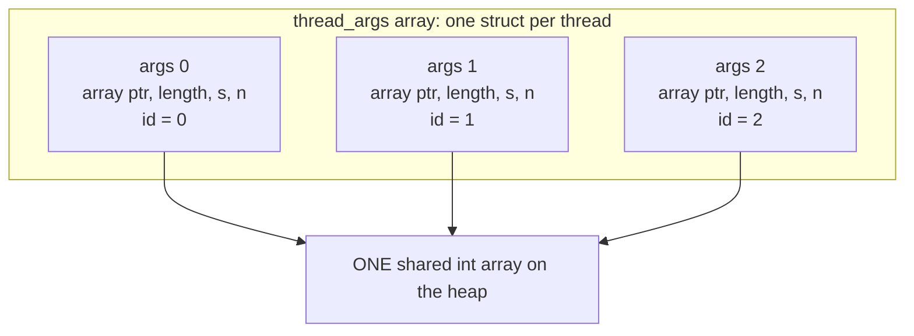

### Why it's helpful
- ⭐ **Solves a pthread limitation:** a thread function gets **only one `void *` argument**. A struct lets you pass **as many values as you want** through that single pointer.
- **No globals:** the function is self-contained, easier to reuse, and easier to reason about.
- Each thread gets its **own** struct, so threads never fight over argument values. They only share what you **intentionally** point to (the array).

### ⭐ Key takeaways
- **One struct per thread**, not one struct shared by all threads. If they shared one, the `id` field would get overwritten.
- The structs **copy the values** (`length`, `s`, …) but **share the array through a pointer**.
- ⚠️ 📎 Note the type change: the globals version used `long *array`, and this one uses `int *array`.

> 🧠 **"One `void*` door, so pack a suitcase (struct)."**

---

## 5. Scalar Multiply: Thread Function Using the Struct

### What it is
The thread function that goes with Program 4. It **unpacks the struct**, then does the same chunking work as Program 3.

### The code

```c
void * scalar_multiply(void* args) {
    //cast to a struct t_arg from void*
    struct t_arg * myargs = (struct t_arg *) args;

    //extract all variables from struct
    long myid =  myargs->id;
    long length = myargs->length;
    long s = myargs->s;
    long nthreads = myargs->numthreads;
    int * ap = myargs->array; //pointer to array in main

    //code as before
    long chunk = length/nthreads;
    long start = myid * chunk;
    long end  = start + chunk;
    if (myid == nthreads-1) {
        end = length;
    }

    int i;
    for (i = start; i < end; i++) {
        ap[i] *= s;
    }

    return NULL;
}
```

### What it's doing

| Part | Purpose |
|---|---|
| `(struct t_arg *) args` | ⭐ Cast the generic `void *` back to the real struct type. |
| `myargs->id` etc. | `->` reads a field **through a pointer** (same as `(*myargs).id`). |
| Copy fields into locals | Local variables live on **this thread's own stack**, so they're private and fast. |
| `int *ap = myargs->array` | The pointer to the **shared** array in `main`. |
| Chunk math + loop | Identical to Program 3. Each thread scales **only its own slice**. |

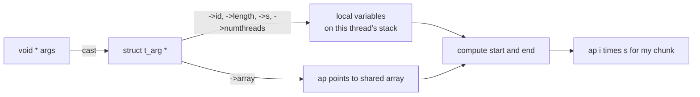

### Why it's helpful
- Shows the **standard unpacking pattern** you'll use in almost every pthread program: **cast, then extract, then work**.
- Combined with Program 4, it's a **clean, reusable data-parallel template**.

### ⭐ Key takeaways
- `void *` in, **cast to your struct**, then pull out the fields.
- Locals are **private** (on each thread's stack). The array is **shared** (on the heap).
- Still **race-free** because the chunks don't overlap.

> 🧠 **"Cast, Extract, Chunk, Loop."**

---

## 6. Shared Sum Data Race

### What it is
⚠️ The lecture's **demonstration of a data race**. Two threads each add 1 to a **shared global** `sum` ten million times.

### The code

```c
#include <stdio.h>
#include <pthread.h>

int sum = 0;

void *sumN(void *arg) {
    int n = *(int *)arg;

    for(int i = 0; i < n; i++) {
      sum = sum + 1;
    }

    return NULL;
}

int main() {
    pthread_t t1, t2;
    int n1 = 10000000;
    int n2 = 10000000;

    pthread_create(&t1, NULL, sumN, &n1);
    pthread_create(&t2, NULL, sumN, &n2);

    pthread_join(t1, NULL);
    pthread_join(t2, NULL);

    printf("Final sum: %d\n", sum);

    return 0;
}
```

### What it's doing
- `sum` is a **global**, so **both threads share it**.
- Each thread loops 10,000,000 times doing `sum = sum + 1`.
- **Expected:** `20000000`. **Actual:** sometimes `20000000`, often **less** (e.g. `18619525`).

### ⭐ Why it breaks
`sum = sum + 1` is **three** machine steps, not one:

```asm
mov rax, [sum]    ; LOAD
add rax, 1        ; ADD
mov [sum], rax    ; STORE
```

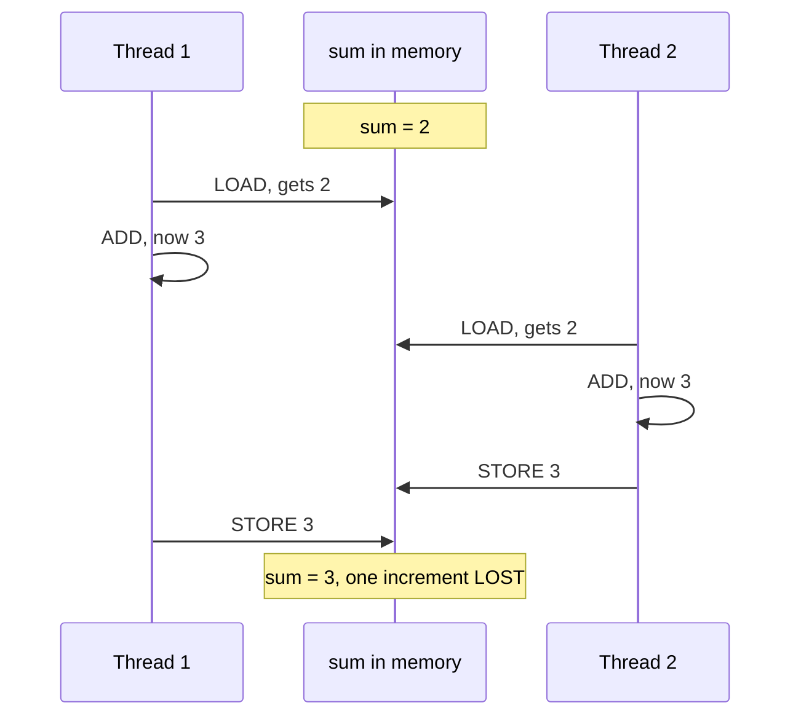

### Compare to Program 3: why is this one broken?

| | Program 3 (scalar multiply) | Program 6 (sum) |
|---|---|---|
| Shared data? | Yes (`array`) | Yes (`sum`) |
| Same memory location written by 2+ threads? | ❌ No, the chunks don't overlap | ✅ **Yes, the same `sum`** |
| Synchronization? | Not needed | ❌ **Missing** |
| Data race? | **No** | ⚠️ **Yes** |

### Why it's helpful
- ⭐ Makes the **data race** concrete: **2+ threads, the same data, at least one write, no synchronization**.
- Shows that **one line of C ≠ one atomic step**.
- Sets up the need for **mutexes** and **critical sections**.

### 📎 SUPPLEMENTAL: Fixed version

```c
pthread_mutex_t lock = PTHREAD_MUTEX_INITIALIZER;

void *sumN(void *arg) {
    int n = *(int *)arg;
    int local = 0;                 // private, on this thread's stack
    for (int i = 0; i < n; i++)
        local++;                   // no sharing, so no race
    pthread_mutex_lock(&lock);     // critical section: ONE short update
    sum += local;
    pthread_mutex_unlock(&lock);
    return NULL;
}
```
Locking **inside** the loop would also be correct, but it's slow (20 million lock/unlock calls). Using a local count and locking **once** is both correct **and** fast.

> 🧠 **Data race = "2 + 1 + 0"**: 2+ threads, 1+ writer, 0 locks.

---

## 7. Counting Sort (Sequential)

### What it is
The **single-threaded baseline** for the lecture's bigger case study. Counting sort works on small-range values (here `0–9`), and the lecture parallelizes it in Programs 8–9.

### The code

```c
#define MAX 10 //the maximum value of an element. (10 means 0-9)

/*step 1:
 * compute the frequency of all the elements in the input array and store
 * the associated counts of each element in array counts. The elements in the
 * counts array are initialized to zero prior to the call to this function.
*/
void countElems(int *counts, int *array_A, long length) {
    int val, i;
    for (i = 0; i < length; i++) {
      val = array_A[i]; //read the value at index i
      counts[val] = counts[val] + 1; //update corresponding location in counts
    }
}

/* step 2:
 * overwrite the input array (array_A) using the frequencies stored in the
 *  array counts
*/
void writeArray(int *counts, int *array_A) {
    int i, j = 0, amt;

    for (i = 0; i < MAX; i++) { //iterate over the counts array
        amt = counts[i]; //capture frequency of element i
        while (amt > 0) { //while all values aren't written
            array_A[j] = i; //replace value at index j of array_A with i
            j++; //go to next position in array_A
            amt--; //decrease the amount written by 1
        }
    }
}

/* main function:
 * gets array length from command line args, allocates a random array of that
 * size, allocates the counts array, the executes step 1 of the CountSort
 * algorithm (countsElem) followed by step 2 (writeArray).
*/
int main( int argc, char **argv ) {
    //code ommitted for brevity -- download source to view full file

    srand(10); //use of static seed ensures the output is the same every run

    long length = strtol( argv[1], NULL, 10 );
    int verbose = atoi(argv[2]);

    //generate random array of elements of specified length
    int *array = malloc(length * sizeof(int));
    genRandomArray(array, length);

    //print unsorted array (commented out)
    //printArray(array, length);

    //allocate counts array and initializes all elements to zero.
    int counts[MAX] = {0};

    countElems(counts, array, length); //calls step 1
    writeArray(counts, array); //calls step2

    //print sorted array (commented out)
    //printArray(array, length);

    free(array); //free memory

    return 0;
}
```

### What it's doing

**Step 1: `countElems`** tallies how many times each value 0–9 appears.
**Step 2: `writeArray`** rewrites the array: `counts[0]` zeros, then `counts[1]` ones, and so on.

### ⭐ Worked example

Input: `[3, 1, 3, 0, 1, 3]`

**Step 1: counts**

| value | 0 | 1 | 2 | 3 | 4–9 |
|---|---|---|---|---|---|
| count | 1 | 2 | 0 | 3 | 0 |

**Step 2: rewrite** → `[0, 1, 1, 3, 3, 3]` ✅ sorted

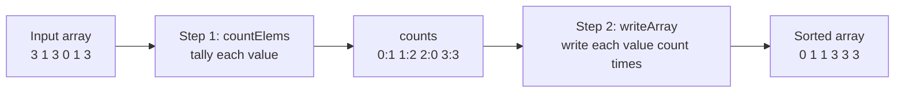

### Supporting details
| Item | Why |
|---|---|
| `#define MAX 10` | Values only range from 0–9, so `counts` only needs 10 slots. |
| `srand(10)` | **Fixed seed**, so the "random" array is the **same every run**. That makes it easy to check that the parallel version gives the same answer. |
| `int counts[MAX] = {0}` | All counts start at zero. |
| `verbose` | Controls whether to print (the prints are commented out here). |

### Why it's helpful
- Gives a **correct baseline** to compare the parallel version against, for both **speed** and **correctness**.
- 📎 Counting sort runs in **O(n + MAX)** time, faster than comparison sorts when values have a small range.
- ⭐ **Step 1 is the expensive part** (it touches all `length` elements, possibly millions), so that's the part worth parallelizing. Step 2 is mostly sequential, since each write position depends on the earlier ones.

### ⭐ Key takeaways
- Two phases: **count**, then **write**.
- **Parallelize the big loop** (step 1). This lines up with the speedup and overhead discussion: whatever stays sequential (step 2) limits the overall speedup.

---

## 8. Parallel countElems (First Cut)

### What it is
The lecture's **first attempt** at parallelizing step 1 of counting sort. It's labeled **"first cut"** because ⚠️ **it has a data race.**

### The code

```c
/*parallel version of step 1 (first cut) of CountSort algorithm:
 * extracts arguments from args value
 * calculates the portion of the array that thread is responsible for counting
 * computes the frequency of all the elements in assigned component and stores
 * the associated counts of each element in counts array
*/
void *countElems( void *args ) {
    struct t_arg * myargs = (struct t_arg *)args;
    //extract arguments (omitted for brevity)
    int *array = myargs->ap;
    long *counts = myargs->countp;
    //... (get nthreads, length, myid)

    //assign work to the thread
    long chunk = length / nthreads; //nominal chunk size
    long start = myid * chunk;
    long end = (myid + 1) * chunk;
    long val;
    if (myid == nthreads-1) {
        end = length;
    }

    long i;
    //heart of the program
    for (i = start; i < end; i++) {
        val = array[i];
        counts[val] = counts[val] + 1;
    }

    return NULL;
}
```

### What it's doing
- Same **unpack → chunk → loop** pattern as Program 5.
- `end = (myid + 1) * chunk` is the same as `start + chunk`, just written differently.
- Each thread counts values in **its own chunk** of `array`...
- ...but they all write into the **same shared `counts` array**.

### ⚠️ ⭐ The hidden data race

| | Reading `array` | Writing `counts` |
|---|---|---|
| Chunks overlap? | No, each thread reads its own slice | ⚠️ **Yes**: if two threads both see a `3`, both update `counts[3]` |
| Safe? | ✅ | ❌ **Data race** |

`counts[val] = counts[val] + 1` is **exactly the same bug as `sum = sum + 1`** in Program 6: load, add, store, interrupted in the middle.

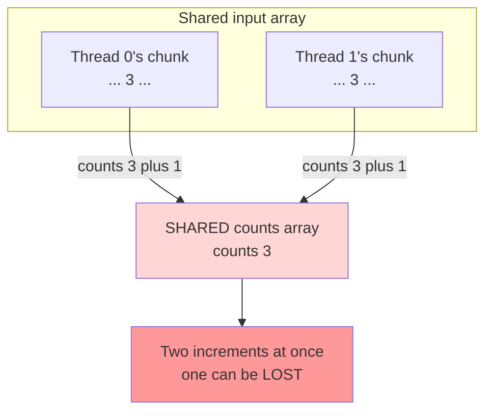

**Result:** the counts can come out **too low**, so the "sorted" array would have the **wrong number of each value**.

### 📎 SUPPLEMENTAL: Why this race is sneaky
- With only **10 possible values** and **millions of elements**, threads hit the **same** `counts[val]` constantly, so the chance of collisions is **very high**.
- It's harder to spot than Program 6 because the **reads look safe** (separate chunks). The shared write is hidden behind an index.

### Why it's helpful
- ⭐ Teaches you to check **every shared write**, not just the obvious ones. **Splitting the input isn't enough if the output is shared.**
- Shows that a "first cut" parallel version can be **fast but wrong**, which is why you compare against the sequential baseline (Program 7, with the fixed `srand(10)` seed).
- Sets up the fixes: a **mutex**, or better, **per-thread local counts** (see the fixes at the end).

### ⭐ Key takeaways
- **Separate input chunks ≠ separate output.**
- `counts[val]++` on a shared array is a **data race**.
- The `"first cut"` label is a hint: **this version is meant to be improved.**

> 🧠 **"Split the reads, but watch the writes."**

---

## 9. Parallel Counting Sort main

### What it is
The `main` function that **launches** the parallel `countElems` threads from Program 8.

### The code

```c
int main(int argc, char **argv) {

    if (argc != 4) {
        //print out usage info (ommitted for brevity)
        return 1;
    }

    srand(10); //static seed to assist in correctness check

    //parse command line arguments
    long t;
    long length = strtol(argv[1], NULL, 10);
    int verbose = atoi(argv[2]);
    long nthreads = strtol(argv[3], NULL, 10);

    //generate random array of elements of specified length
    int *array = malloc(length * sizeof(int));
    genRandomArray(array, length);

    //specify counts array and initialize all elements to zero
    long counts[MAX] = {0};

    //allocate threads and args array
    pthread_t *thread_array; //pointer to future thread array
    thread_array = malloc(nthreads * sizeof(pthread_t)); //allocate the array
    struct t_arg *thread_args = malloc( nthreads * sizeof(struct t_arg) );

    //fill thread array with parameters
    for (t = 0; t < nthreads; t++) {
        //ommitted for brevity...
    }

    for (t = 0; t < nthreads; t++) {
        pthread_create(&thread_array[t], NULL, countElems, &thread_args[t]);
    }

    for (t = 0; t < nthreads; t++) {
        pthread_join(thread_array[t], NULL);
    }

    free(thread_array);
    free(array);

    if (verbose) {
        printf("Counts array:\n");
        printCounts(counts);
    }
    return 0;
}
```

### What it's doing

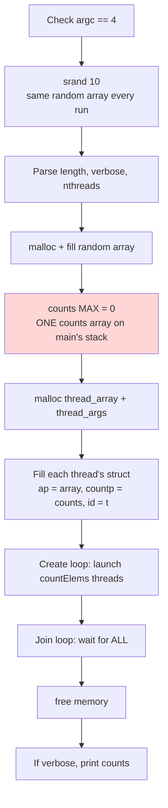

### 📎 SUPPLEMENTAL: What the omitted fill loop likely contains
Based on the fields Program 8 reads:

```c
for (t = 0; t < nthreads; t++) {
    thread_args[t].ap = array;        // shared input
    thread_args[t].countp = counts;   // SHARED output, the source of the race
    thread_args[t].length = length;
    thread_args[t].numthreads = nthreads;
    thread_args[t].id = t;
}
```

### ⭐ Important details

| Detail | Why it matters |
|---|---|
| `argc != 4` | Needs 3 user args: `length`, `verbose`, `nthreads`. Usage: `./countsort 100000000 1 4`. |
| `long counts[MAX]` | ⭐ It lives on **main's stack**, yet other threads can still access it **through a pointer**. That works because all threads share one address space. It's only safe because `main` **joins before returning**. |
| Every thread gets the **same** `counts` pointer | ⚠️ This is **why** Program 8 races. |
| `srand(10)` | Same input every run. If the printed counts **change between runs**, that **proves** there's a race. |
| Join **before** printing counts | Results are only complete after **all** threads finish. |
| 📎 `thread_args` is never freed | A minor memory leak. Adding `free(thread_args);` would fix it. |
| 📎 Step 2 (`writeArray`) isn't called here | This version focuses only on parallelizing step 1. |

### Why it's helpful
- Shows the **full parallel program skeleton**: parse → allocate → fill args → create → join → clean up → report.
- The **fixed seed** plus **verbose output** turns `main` into a **correctness test**: compare the counts to the sequential version. Different numbers mean a data race.
- 📎 Run it with `nthreads = 1, 2, 4, 8` and time it to **measure speedup** (`S = T₁ / Tₙ`), which ties back to the objectives.

### ⭐ Key takeaways
- Stack variables in `main` **can be shared** with threads through pointers, as long as `main` waits for them (joins).
- Passing **the same output pointer to every thread** is a red flag. Ask yourself: **"Do two threads write the same spot?"**

---

## Patterns Across All Programs

### ⭐ The universal pthread recipe

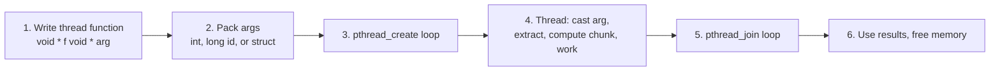

### Program comparison table

| # | Args passed as | Shared data | Parallelism type | Data race? |
|---|---|---|---|---|
| 1 | `int *` | none written | Task 📎 (or data, depending on framing) | ❌ |
| 2 | `long *` (ID) | none written | n/a (demo) | ❌ |
| 3 | `long *` (ID) + globals | `array` (separate chunks) | **Data** | ❌ |
| 4–5 | `struct t_arg *` | `array` (separate chunks) | **Data** | ❌ |
| 6 | `int *` | `sum` (same location) | n/a (demo) | ⚠️ **Yes** |
| 7 | (sequential) | n/a | none | ❌ |
| 8–9 | `struct t_arg *` | `counts` (same locations) | **Data** | ⚠️ **Yes** |

### ⭐ Race-check questions for any threaded code
1. What memory is **shared**? (globals, heap, and pointers passed to multiple threads)
2. Does any thread **write** to it?
3. Can **two threads write or read-write the same location**?
4. If yes, is it **protected** (mutex) or **avoided** (private local copies)?

---

## 📎 Supplemental Fixes for Program 8

The lecture labels Program 8 a "first cut." These are two standard ways to fix it, building on the mutex ideas from the module.

### Fix A: Mutex around the shared update (correct, but slow)

```c
pthread_mutex_t mutex = PTHREAD_MUTEX_INITIALIZER;

for (i = start; i < end; i++) {
    val = array[i];
    pthread_mutex_lock(&mutex);        // enter critical section
    counts[val] = counts[val] + 1;
    pthread_mutex_unlock(&mutex);      // exit critical section
}
```
- ✅ Correct.
- ❌ Locks and unlocks **once per element**, so threads spend most of their time waiting. It can be **slower than sequential** because of **synchronization overhead**.

### Fix B: Private local counts, then merge once (correct and fast) ⭐

```c
long local_counts[MAX] = {0};          // private, on this thread's stack

for (i = start; i < end; i++) {
    val = array[i];
    local_counts[val] = local_counts[val] + 1;   // no sharing, no race
}

pthread_mutex_lock(&mutex);            // ONE short critical section
for (i = 0; i < MAX; i++) {
    counts[i] += local_counts[i];
}
pthread_mutex_unlock(&mutex);
```
- ✅ Correct.
- ✅ Fast: only **one** lock per thread instead of millions.
- ⭐ This is the general principle: **do the work privately, then share briefly.**

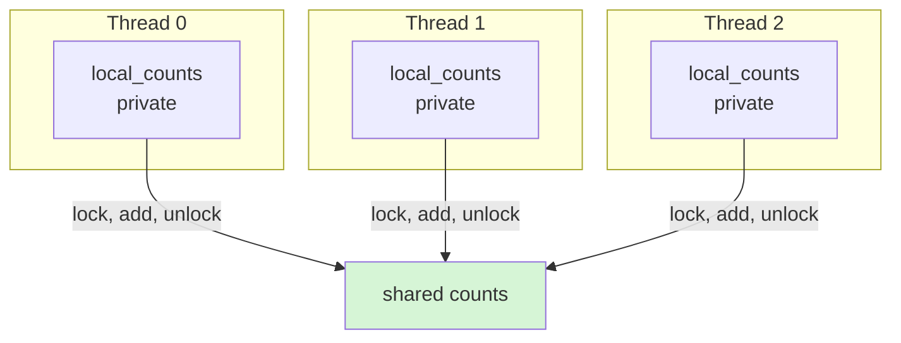

| Version | Correct? | Lock calls | Speed |
|---|---|---|---|
| Program 8 (first cut) | ❌ | 0 | Fast but **wrong** |
| Fix A (lock per element) | ✅ | ~`length` (millions) | 🐢 Slow |
| Fix B (local + merge) | ✅ | `nthreads` | 🚀 Fast |

> 🧠 **"Work alone, merge once."**
